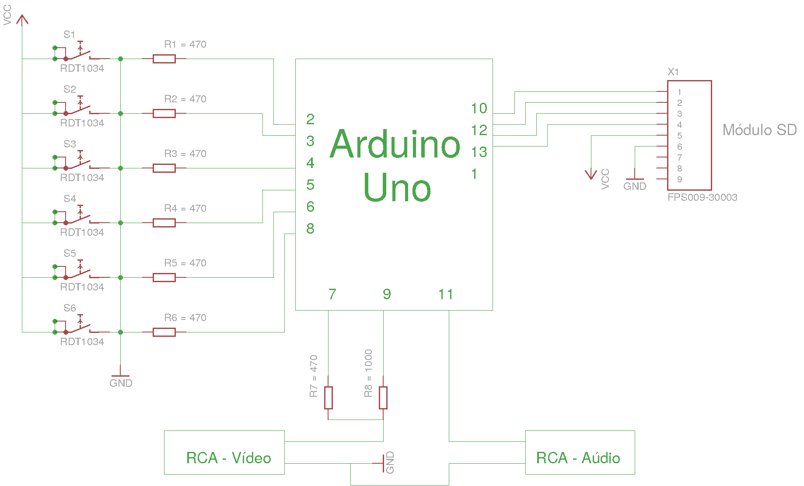
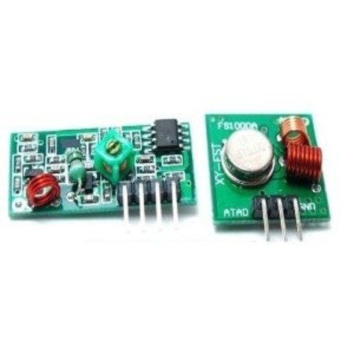

# Arduino Game Console (2015)

A game console project I built in 2015 at end of High School using Arduino and the library TV Out. I finished coding Tetris, Snake and Pong. There was a game left unfinished

I made a wireless controller using RF transmitters. I'll try to add more details on this later

